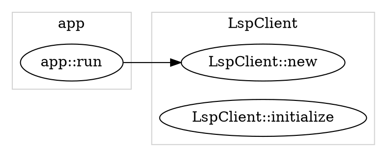

# gen_callgraph

A Rust call graph generator powered by rust-analyzer's Language Server Protocol (LSP).

Generate beautiful, structured call graphs from your Rust code with automatic grouping by classes and modules.

## Features

- **LSP-Based Analysis**: Leverages rust-analyzer for accurate symbol resolution
- **Structured Visualization**: Automatic grouping by classes and modules into subgraphs
- **Smart Symbol Resolution**: Multi-strategy approach combining LSP data with source analysis
- **Call Hierarchy Tracking**: Follows function calls through your entire codebase
- **DOT Format Output**: Generates GraphViz DOT files for flexible visualization

## Usage

### Basic Usage

```bash
gen_callgraph [WORKSPACE] [ENTRY_FUNCTION] [OUTPUT_PATH]
```

### Arguments

- `WORKSPACE` (optional): Path to the Rust workspace/project root. Defaults to current directory.
- `ENTRY_FUNCTION` (optional): Name of the entry function to start analysis from. Default: `main`
- `OUTPUT_PATH` (optional): Path for the output DOT file. Default: `tmp/callgraph.dot`

### Examples

#### Generate call graph for `main` function in current directory

```bash
gen_callgraph
```

#### Specify workspace and entry function

```bash
gen_callgraph /path/to/project my_function output.dot
```

#### Analyze a specific function

```bash
gen_callgraph . calculate_fibonacci fibonacci_graph.dot
```

### Visualizing the Output

The generated DOT file can be visualized using GraphViz:

```bash
# Generate PNG image
dot -Tpng callgraph.dot -o callgraph.png

# Generate SVG (recommended for large graphs)
dot -Tsvg callgraph.dot -o callgraph.svg

# Interactive viewing
xdot callgraph.dot  # Linux
open -a GraphViz callgraph.dot  # macOS
```

## How It Works

### Symbol Resolution Strategy

`gen_callgraph` uses a prioritized multi-strategy approach to resolve function ownership and grouping:

1. **SymbolInformation.container_name** (Priority 1)
   - Most reliable when rust-analyzer provides it
   - Direct from LSP server

2. **CallHierarchyItem.detail** (Priority 2)
   - Parses impl block information
   - Extracts types from `impl MyStruct` declarations

3. **Source File Analysis** (Priority 3)
   - Reads actual Rust source files
   - Searches for enclosing impl blocks
   - Fallback when LSP data is incomplete

4. **Module Path Inference** (Priority 4)
   - Derives module structure from file paths
   - Maps `src/foo/bar.rs` → `foo::bar`

5. **Default Grouping** (Priority 5)
   - Uses "functions" group as catch-all
   - Applied when all other strategies fail

### Output Structure

The generated DOT file includes:

- **Subgraphs** for each class/module
- **Nodes** representing functions with qualified names
- **Edges** showing call relationships

Example output structure:



## Troubleshooting

### "Entry function not found" Error

If you encounter the error `entry function not found: <name>`:

1. **Ensure rust-analyzer is running correctly**
   ```bash
   rust-analyzer --version
   ```

2. **Check workspace indexing**
   - The tool automatically waits for rust-analyzer to index your workspace
   - For very large projects, this may take longer

3. **Verify function visibility**
   - Make sure the entry function exists in your workspace
   - Check that it's in one of the standard locations: `src/main.rs` or `src/lib.rs`

4. **Use qualified names for non-entry functions**
   - For library functions, you may need to use the full path

See [TROUBLESHOOTING.md](../TROUBLESHOOTING.md) for more details.

### LSP Communication Issues

If you experience LSP timeout errors:

1. Increase the timeout in the source code (in `app.rs`)
2. Check that rust-analyzer is not blocked by another process
3. Verify your project compiles successfully with `cargo check`

### Empty or Incomplete Graphs

If the generated graph is missing functions:

1. **Check function visibility**: Only functions within the workspace are included
2. **Verify call hierarchy support**: Some functions may not support call hierarchy
3. **Review workspace structure**: Ensure all relevant code is in the workspace

## Development

### Running Tests

```bash
# Run all tests
cargo test

# Run tests with output
cargo test -- --nocapture

# Run specific test module
cargo test symbol_locator

# Run integration tests only
cargo test --test '*'
```

### Project Structure

```
gen_callgraph/
├── src/
│   ├── main.rs              # Entry point
│   ├── app.rs               # Main application logic
│   ├── cli.rs               # Command-line interface
│   ├── error.rs             # Error types
│   ├── call_graph.rs        # Call graph data structures
│   ├── call_graph_builder.rs  # Graph construction logic
│   ├── dot_renderer.rs      # DOT format output
│   ├── call_graph/
│   │   ├── meta_resolver.rs    # Function metadata resolution
│   │   └── symbol_locator.rs   # Symbol search and discovery
│   └── lsp/                    # LSP client implementation
│       ├── framed.rs
│       ├── framed_wrapper.rs
│       ├── message_creator.rs
│       ├── message_parser.rs
│       ├── stdio_transport.rs
│       ├── transport.rs
│       └── types.rs
├── tests/                   # Integration tests
└── docs/                    # Documentation

```

### Architecture

- **LSP Client Layer**: Handles communication with rust-analyzer
- **Symbol Resolution Layer**: Finds and resolves function symbols
- **Call Graph Builder**: Constructs the graph by traversing call hierarchy
- **Renderer Layer**: Converts graph to DOT format

See [docs/dev/ARCHITECTURE.md](docs/dev/ARCHITECTURE.md) for more details.

## Contributing

Contributions are welcome! Please:

1. Fork the repository
2. Create a feature branch
3. Add tests for new functionality
4. Ensure all tests pass: `cargo test`
5. Submit a pull request

## Documentation

- [TROUBLESHOOTING.md](../TROUBLESHOOTING.md) - Common issues and solutions
- [GROUPING_RESTORATION.md](../GROUPING_RESTORATION.md) - Details on the grouping feature
- [REFACTORING_REPORT.md](REFACTORING_REPORT.md) - Recent refactoring work

## License

See [LICENSE](LICENSE) for details.

## Acknowledgments

- Built on top of [rust-analyzer](https://rust-analyzer.github.io/)
- Uses [lsp-types](https://github.com/gluon-lang/lsp-types) for LSP communication
- Inspired by various call graph generation tools

---

**Note**: This tool requires an active rust-analyzer server and works best with projects that have been successfully compiled at least once.
